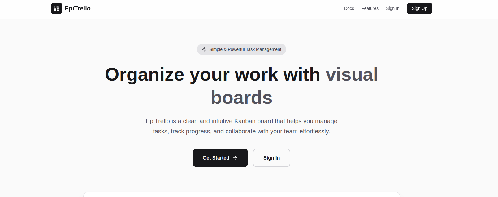

# Setting Up EpiTrello

Follow these simple steps to install and run EpiTrello on your Linux computer.



## Requirements

Before you start, make sure you have:
- **Linux** (Ubuntu, Debian, or similar)
- **Internet connection**
- **A text editor** (gedit, nano, or similar)
- About **10 minutes** of time

## Step 1: Get the Code

Open your terminal and run this command:

```bash
git clone https://github.com/yourusername/epitrello.git
cd epitrello
```

If `git` is not installed, run:
```bash
sudo apt update
sudo apt install git
```

Then try the clone command again.

## Step 2: Install Dependencies

In the same terminal, run:

```bash
npm install
```

This downloads everything the app needs to run. It may take 2-5 minutes.

If `npm` is not installed:
```bash
sudo apt update
sudo apt install nodejs npm
```

Then try the install command again.

## Step 3: Start the Database

Run this command in your terminal:

```bash
docker compose up
```

Wait for this message to appear:
```
epitrello-app | ▲ Next.js 15.5.6
epitrello-app | - Local: http://localhost:3000
```

This means the app is ready!

**Note:** If `docker` is not installed, run:
```bash
sudo apt update
sudo apt install docker.io docker-compose
sudo usermod -aG docker $USER
newgrp docker
```

Then try the command again.

## Step 4: Open EpiTrello

Open your web browser and go to:

```
http://localhost:3000
```

You should see the EpiTrello homepage. You're done! 🎉

## Troubleshooting

### "Port 3000 already in use"
Another app is using port 3000. Stop it or use a different port:
```bash
PORT=3001 npm run dev
```

Then open `http://localhost:3001`

### "docker compose: command not found"
Docker isn't installed. Install it:
```bash
sudo apt install docker-compose
```

### "git: command not found"
Git isn't installed. Install it:
```bash
sudo apt install git
```

### "npm: command not found"
Node.js isn't installed. Install it:
```bash
sudo apt install nodejs npm
```

### "Cannot connect to database"
The database might not have started. Make sure you ran `docker compose up` and wait 30 seconds.

### "The page won't load"
- Wait 10 seconds for the app to fully start
- Refresh your browser (F5)
- Check that you're visiting `http://localhost:3000`

## Stopping EpiTrello

To stop the app, press `Ctrl+C` in your terminal.

To stop and delete the database, run:
```bash
docker compose down -v
```

## Starting Again Later

To run EpiTrello again:
```bash
cd epitrello
docker compose up
```

Then open `http://localhost:3000` in your browser.

## Next Steps

Now that EpiTrello is running:
1. Create an account
2. Create your first board
3. Start organizing your tasks!

For help using the app, see [userdoc](./userdoc.md).

---

**Need help?** Check the troubleshooting section above or contact support.