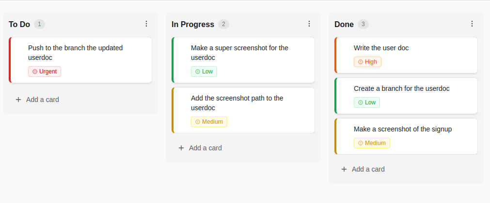

# User Documentation

Welcome to EpiTrello! This section contains guides for using the application.

## Getting Started

### [Set Up Guide](./setup.md)
Learn how to set up Epitrello

### [Account Management](./account.md)
Learn how to create an account, sign in, manage your profile, and keep your account secure.

---

## What is EpiTrello?

EpiTrello is a simple, visual project management tool that helps you organize your work using boards and cards. Think of it like a digital bulletin board where you can:

- **Create Boards** for different projects
- **Organize Tasks** into columns (like "To Do", "In Progress", "Done")
- **Track Progress** by moving cards between columns
- **Collaborate** with teammates on shared boards

## Key Features

### 📋 Kanban Boards
Visualize your workflow with columns representing different stages of your work.

### ✅ Task Management
Create cards for individual tasks with details like priority, due dates, and descriptions.

### 👥 Team Collaboration
Invite team members to boards and assign tasks to keep everyone on the same page.

### 🎨 Customization
Choose colors, add tags, set priorities, and organize your boards your way.

### 🌙 Dark Mode
Work comfortably in any lighting with our built-in dark mode.

## Common Tasks

### Creating Your First Board
1. Sign in to your account
2. Click "Create New Board"
3. Give your board a name and optional description
4. Start adding columns and cards

### Adding Tasks
1. Open a board
2. Click "Add a card" in any column
3. Enter the task title and description
4. Set priority and due date if needed
5. The card is saved automatically

### Moving Tasks
Simply drag cards between columns to update their status. Your changes are saved instantly.

### Inviting Teammates
1. Open your board
2. Click the team icon
3. Enter your teammate's email
4. They'll receive an invitation to join

## Tips & Tricks

- **Use Colors**: Assign different colors to cards to quickly identify types of work
- **Set Due Dates**: Keep track of deadlines and see which tasks are overdue at a glance
- **Add Tags**: Use tags like "bug", "feature", "urgent" to categorize tasks
- **Assign Tasks**: Make it clear who's responsible for each task
- **Filter Cards**: Use filters to focus on specific priorities, assignees, or tags

## Troubleshooting

### Can't Log In?
Make sure you're using the correct email and password.

### Forgot Your Password?
Password reset isn't available yet.

### Invitations Not Working?
Verify the email address is spelled correctly.

## Getting Help

Need help? Check the [Account Management guide](./account.md) for account-related questions.

---